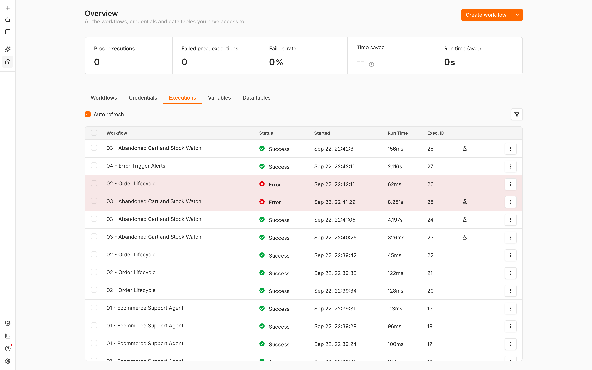
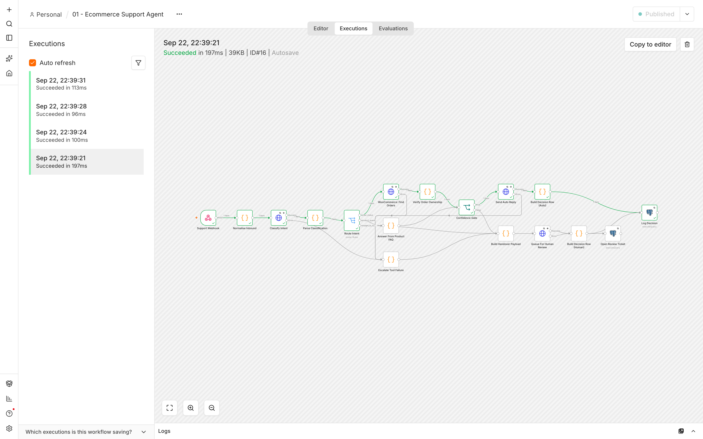
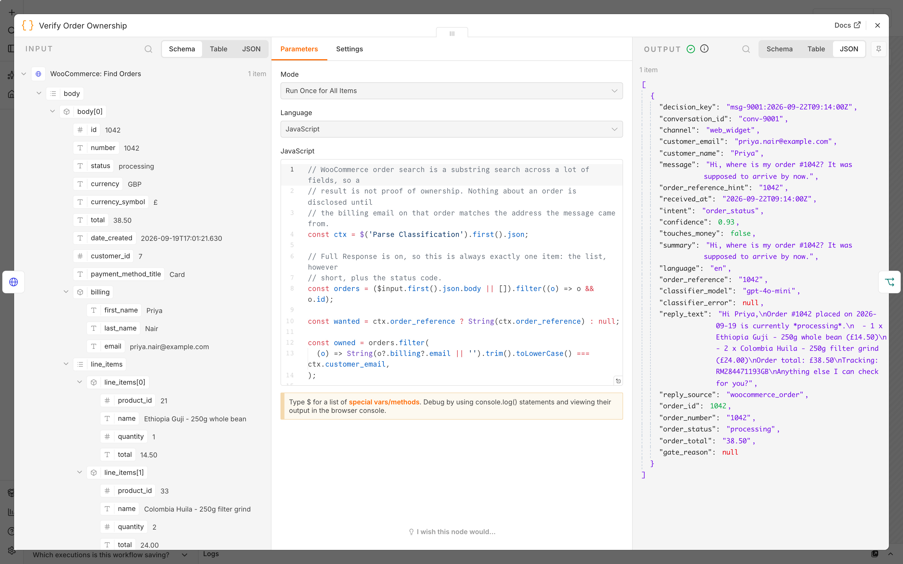
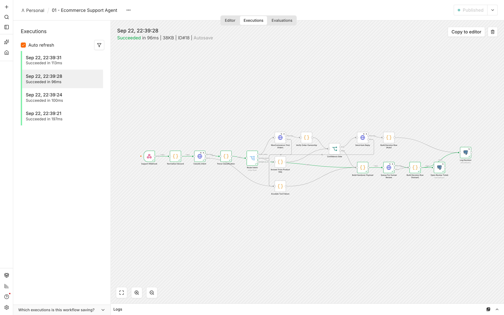
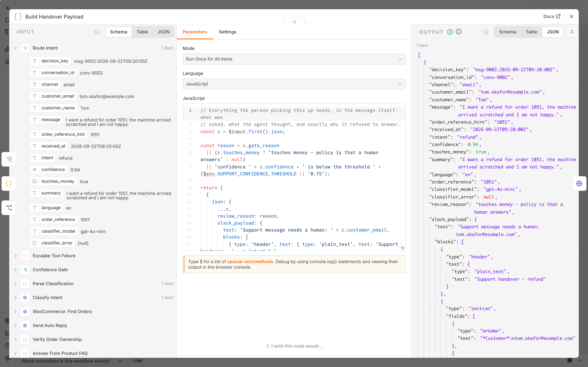
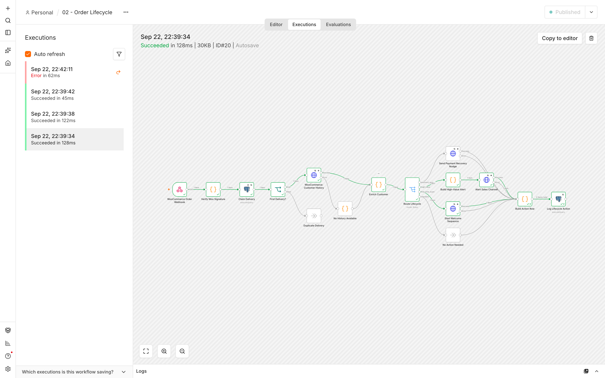
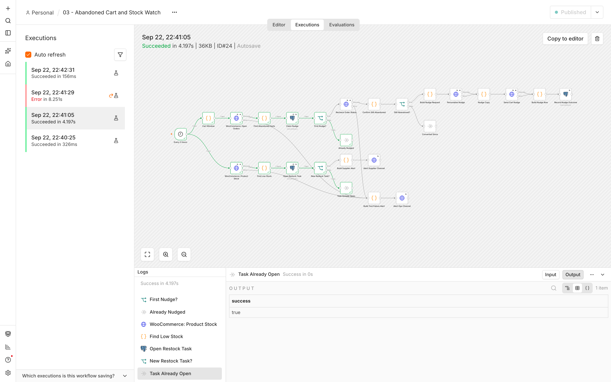
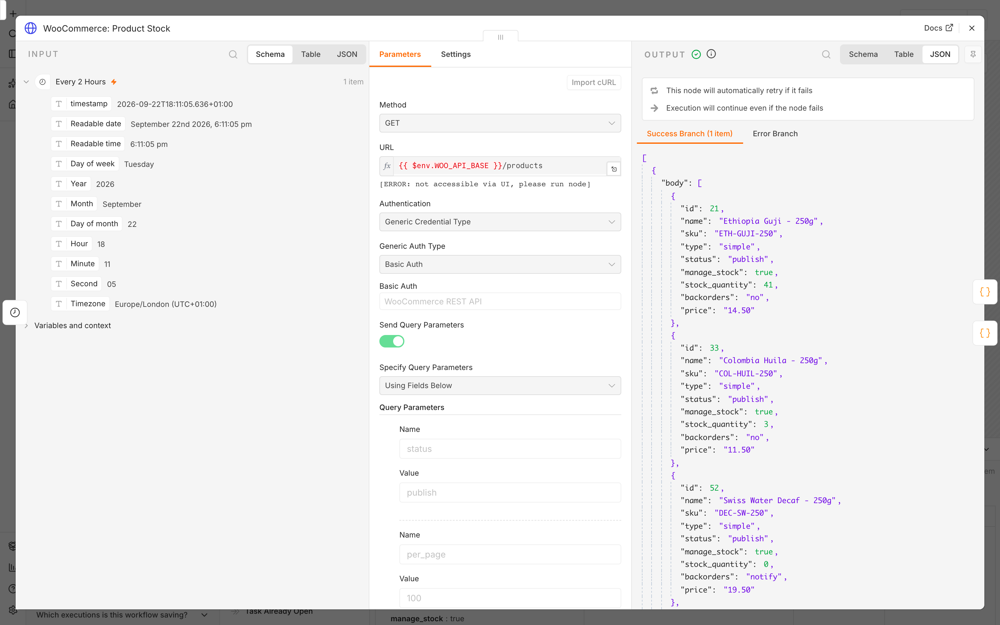
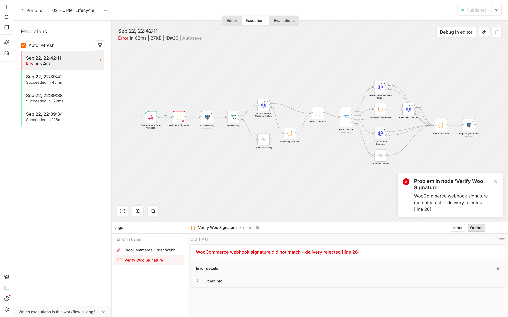
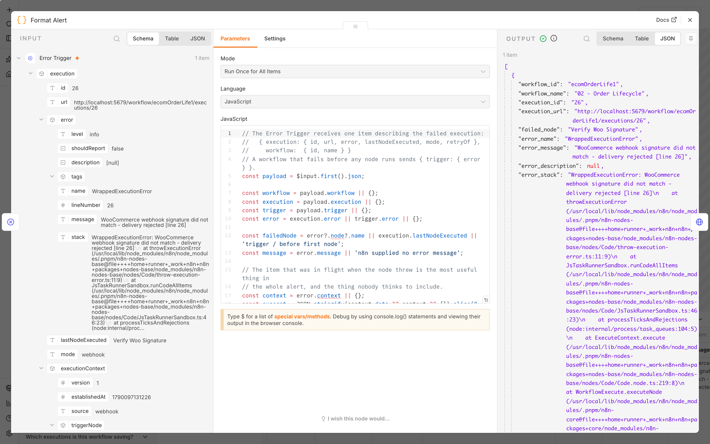

# n8n Ecommerce AI Agent (WooCommerce)

Four n8n workflows that run the repetitive half of a WooCommerce store's day: an
AI support agent that answers from the store's own data and hands anything it is
not sure about to a human, order-lifecycle automation, an abandoned-cart and
stock watch, and one place where every failure surfaces.

Built for n8n **2.40.5** and Postgres **17**. Every workflow in `workflows/` was
imported into a real n8n instance, executed, and screenshotted — the screenshots
below are that instance, not mockups.

---

## The four workflows

| File | Trigger | What it does |
|---|---|---|
| [`01-support-agent.json`](workflows/01-support-agent.json) | Webhook `POST /webhook/support/inbound` | Classifies an inbound customer message with an LLM against a strict JSON schema, answers order-status questions from the live WooCommerce order and product questions from a store FAQ, and sends anything low-confidence or money-related to a human queue in Slack instead of guessing. Every decision, both branches, is logged. |
| [`02-order-lifecycle.json`](workflows/02-order-lifecycle.json) | Webhook `POST /webhook/woocommerce/order-events` | Verifies the WooCommerce HMAC, deduplicates the delivery, enriches the customer with lifetime value and order count, then branches: high-value order alerts sales, first-time buyer starts a welcome sequence, unpaid order gets a recovery nudge. |
| [`03-abandoned-cart-and-stock.json`](workflows/03-abandoned-cart-and-stock.json) | Schedule, every 2 hours | Finds orders left unpaid between 4 and 48 hours ago, re-reads each one immediately before sending so nobody who has just paid is nudged, sends one AI-personalised email per cart ever, and in parallel opens a restock task and alerts the supplier channel for anything at or below the stock threshold. |
| [`04-error-trigger-alerts.json`](workflows/04-error-trigger-alerts.json) | Error Trigger | Fires whenever any of the above fails. Posts the workflow, failing node, error, the item that was in flight and a link to the execution, then writes the failure to a table whether or not Slack accepted the message. |

Node count: 17, 16, 26 and 4. All four are plain `n8n-nodes-base` nodes — no
community packages, nothing to install.

---

## Proof it runs

`docs/screenshots/` is a real n8n 2.40.5 instance on Postgres 17.6, started from
`infra/docker-compose.yml`, with these four files imported by
`n8n import:workflow --separate`. Thirteen executions:

| # | Workflow | Mode | Result | Time |
|---|---|---|---|---|
| 16 | 01 Support Agent | webhook | success — order status answered from WooCommerce | 197 ms |
| 17 | 01 Support Agent | webhook | success — shipping question answered from the FAQ | 100 ms |
| 18 | 01 Support Agent | webhook | success — refund request held for a human | 96 ms |
| 19 | 01 Support Agent | webhook | success — ambiguous message held for a human | 113 ms |
| 20 | 02 Order Lifecycle | webhook | success — £284 first order: sales alert **and** welcome sequence | 128 ms |
| 21 | 02 Order Lifecycle | webhook | success — failed payment: recovery nudge | 122 ms |
| 22 | 02 Order Lifecycle | webhook | success — duplicate delivery, correctly did nothing | 45 ms |
| 23 | 03 Cart + Stock | manual | success — 2 carts nudged, 2 restock tasks opened | 326 ms |
| 24 | 03 Cart + Stock | manual | success **after two HTTP 500s** — retried and recovered | 4197 ms |
| 25 | 03 Cart + Stock | manual | error — WooCommerce and Slack both hard down, retries exhausted | 8251 ms |
| 26 | 02 Order Lifecycle | webhook | error — forged WooCommerce signature rejected | 62 ms |
| 27 | 04 Error Trigger | **error** | success — alerted and recorded the failure of execution 26 | 2116 ms |
| 28 | 03 Cart + Stock | manual | success — re-run sent zero duplicate emails | 156 ms |

<p align="center"></p>

**A question answered from the store, not from the model.** The customer asked
where order #1042 was. The workflow read the order out of WooCommerce, checked
the billing email against the address the message came from, and built the reply
from the fields it got back.

<p align="center"></p>
<p align="center"></p>

**The confidence gate.** A refund request: the classifier was 94% confident, and
that is exactly why it was *not* auto-answered. The gate refuses anything that
touches money regardless of confidence.

<p align="center"></p>
<p align="center"></p>

**Order lifecycle** — a £284 first order fires both the sales alert and the
welcome sequence, because it is genuinely both.

<p align="center"></p>

**Cart and stock**, and a retry. Execution 24 is the same workflow as execution
23, except WooCommerce returned `500` twice. `retryOnFail` absorbed it: same
result, 4197 ms instead of 326 ms.

```
GET /woo/products -> 500 (injected)
GET /woo/products -> 500 (injected)
GET /woo/products -> 200          <- third attempt, execution continues
```

<p align="center"></p>
<p align="center"></p>

**Nothing fails quietly.** A forged WooCommerce signature failed execution 26,
which fired workflow 04 (mode `error`), which alerted Slack and wrote the row.

<p align="center"></p>
<p align="center"></p>

What the database held afterwards:

```
 workflow_failures │ 02 - Order Lifecycle │ Verify Woo Signature │ alert_delivered: t

 support_agent_daily
          day       │ messages │ auto_replied │ handed_over │ deflection_pct │ avg_confidence
 2026-09-22         │        4 │            2 │           2 │           50.0 │          0.688
```

---

## What was mocked, and what was not

Every node, expression, query and Code node in `workflows/` ran exactly as
committed. Two things were filled in at import time, and they are the same two
things any n8n user fills in on their own instance: the three credential ids
(the files ship `"id": null` so no instance id leaks into the repo) and the real
id of workflow 04 in place of `REPLACE_WITH_WORKFLOW_04_ID`. Everything else that
differs from a live store is the value of an environment variable.

| Real in the screenshots | Mocked |
|---|---|
| n8n 2.40.5, Postgres 17.6, in Docker | The WooCommerce REST API (`/wp-json/wc/v3/orders`, `/products`) |
| Every node, expression, Code node and query in `workflows/` | The OpenAI-compatible `/chat/completions` endpoint |
| The HMAC verification, the confidence gate, the retries, the idempotency constraints | The helpdesk reply API and the email sender |
| The real Postgres tables in `sql/schema.sql` | Slack incoming webhooks |
| The executions, timings and failures above | |

The `*_API_BASE` and `SLACK_*_WEBHOOK_URL` variables pointed at
`http://host.docker.internal:5799/...` instead of a real store, model provider
and Slack workspace. No node parameter was edited to make that work — that is
the whole reason every endpoint in these files is `{{ $env.X }}`.

`test/mocks/server.mjs` is ~300 lines of `node:http` that answers those five
services with realistic fixtures, and can inject HTTP 500s on demand — that is
how executions 24 and 25 were produced.

**No API key was needed.** The LLM call is a plain HTTP Request node to
`{{ $env.LLM_API_BASE }}/chat/completions` with `response_format:
{ type: "json_schema", strict: true }`. The mock returns a schema-valid
classification, so the *parsing, validation, routing and gating* all ran for
real — only the model's judgement was substituted. Point `LLM_API_BASE` at
`https://api.openai.com/v1`, fill in the credential, and the same workflow calls
OpenAI. Nothing else changes; the same is true for Azure OpenAI, Groq or a local
vLLM.

Run it yourself:

```bash
node test/mocks/server.mjs          # terminal 1
cd infra && cp .env.example .env    # point the *_API_BASE vars at the mock
docker compose up -d
docker compose exec n8n n8n import:workflow --separate --input=/workflows
```

---

## The decisions that matter

**The confidence gate is three conditions, all required.** There has to be a
grounded answer, the classifier has to clear `SUPPORT_CONFIDENCE_THRESHOLD`, and
the message must not touch money. Refunds, cancellations, chargebacks and
discount requests never reach an answering branch at all — they are routed
straight to the human queue by intent. The model's own "touches money" flag is
trusted only in the direction that adds caution: a keyword sweep can raise it,
nothing can lower it.

**Answers are grounded or they are not sent.** Order questions are answered from
a WooCommerce read taken seconds earlier; product questions from a fixed FAQ
corpus. If neither produces text, `reply_text` is null and the gate fails. The
model chooses a route; it never writes the facts.

**Ownership is checked before anything is disclosed.** WooCommerce order search
is a substring match across many fields, so a hit is not proof of ownership.
Nothing about an order is said until the billing email on that order matches the
address the message came from. In execution 19 a customer asked about order 1042
from an unrelated address and got a human, not an order status.

**Idempotency is a unique constraint, never a prior SELECT.** Two concurrent
deliveries of the same webhook would both find nothing and both insert. Every
guard is `INSERT ... ON CONFLICT ... DO NOTHING RETURNING`, with
`alwaysOutputData` on so a duplicate still produces an item for the IF below to
see. The cart nudge row is claimed *before* the email is sent: a crash between
the two costs one missed email, which is much cheaper than a second one.

**Retries are on every external call**, with a gap between attempts — an
immediate retry just hits the same failure.

**Error routing differs by node type, on purpose.** A mid-flow HTTP call routes
its error output somewhere useful: an LLM outage becomes a human handover in 01
and template copy in 03, and a failed WooCommerce history read makes the customer
"unknown" rather than "new", so nobody who has shopped here for three years gets
a welcome email. Postgres nodes do the opposite: a database failure fails the
execution, because continuing past a failed idempotency claim could email
somebody twice. Terminal Slack alerts have no error output either — after three
tries the execution fails, and workflow 04 picks it up.

**An empty list is a state, not silence.** A node that emits zero items ends its
branch and the execution is still recorded as a success. Every WooCommerce list
call is read as a full response, so "this customer has no orders" is one visible
item the workflow can act on. (`alwaysOutputData` does not cover this: n8n only
substitutes an empty item when a node produced no output arrays at all, and a
node with an error output always produces two.)

**The recheck before the send.** Between the cart query and the email, a customer
may have gone back and paid. Every order is re-read individually immediately
before the nudge, matched by order id rather than by position.

**Every decision is logged, both branches.** `support_decisions` is what you read
when a client asks "why did the bot say that", and what you group by to decide
whether the threshold can come down. `sql/schema.sql` ships the two views that
answer it.

---

## Validator

```
$ node --test test/validate.mjs
ℹ tests 57
ℹ pass 57
ℹ fail 0
```

`test/validate.mjs` parses every workflow and checks the things that only break
after you have imported the file into a live instance:

- valid JSON with the keys n8n expects; unique node names and ids
- every connection points at a node that exists; one trigger; no unreachable nodes
- every external call has `retryOnFail`, `maxTries ≥ 2` and `waitBetweenTries ≥ 1s`
- no error output left dangling, and `continueRegularOutput` — which passes a
  failed call off as a success — banned outright
- no `$('Node').item` inside a Code node running in "all items" mode, where it
  throws at runtime and only at runtime
- every list lookup returns the full response, so an empty list cannot silently
  end a branch
- `executionOrder: v1`, failed-execution data kept, and `errorWorkflow` set on
  everything except 04 (which must not point at itself)
- no secrets and no hard-coded URLs — every endpoint is `{{ $env.X }}`
- every `$env` var the workflows read is actually passed to the container
- every table a query writes to exists in `sql/schema.sql`, and every
  `ON CONFLICT` target has a matching unique index
- both webhooks authenticate the caller in constant time before any side effect,
  and 02 verifies the HMAC over the raw body
- the confidence gate still checks all three conditions with an `and`

---

## Repository

```
workflows/     the four workflow JSON files — import these
infra/         docker-compose.yml, .env.example, render.yaml, db init
sql/schema.sql decision log, human review queue, idempotency ledger,
               restock tasks, failures, and two reporting views
test/          validate.mjs (node --test) and mocks/server.mjs
docs/          screenshots from the real instance
```

### Importing

```bash
docker compose exec n8n n8n import:workflow --separate --input=/workflows
```

Then, once, in the n8n UI:

1. Create three credentials with these exact names — the workflows reference
   them by name and ship with `"id": null`, so nothing from another instance
   leaks into the repo:
   - **`WooCommerce REST API`** — HTTP Basic Auth. Consumer key as the user,
     consumer secret as the password.
   - **`LLM API Key`** — HTTP Header Auth. Name `Authorization`, value
     `Bearer sk-…`.
   - **`Postgres - ecommerce ops`** — host `postgres`, database `ecom_ops`.
2. Open workflow 04, copy its id from the URL, and set it as the **Error
   workflow** in the settings of 01, 02 and 03. They ship with the placeholder
   `REPLACE_WITH_WORKFLOW_04_ID` so that a missing step is obvious rather than
   silent.
3. Point WooCommerce at workflow 02: *Settings → Advanced → Webhooks*, topics
   `order.created` and `order.updated`, delivery URL
   `https://your-n8n/webhook/woocommerce/order-events`, and put the same secret
   in `WOO_WEBHOOK_SECRET`.
4. Activate all four.

---

## Deploying free on Render

`infra/render.yaml` is a Render Blueprint: fork this repo, then **New →
Blueprint** in the Render dashboard and pick the fork. It creates a free managed
Postgres and a web service running the official n8n image, generates the
encryption key, and prompts for the handful of values marked `sync: false`.
After the first deploy, set `WEBHOOK_URL` and `N8N_EDITOR_BASE_URL` to the URL
Render gives you (with a trailing slash) and redeploy, then apply the schema:

```bash
psql "<external connection string from Render>" -f sql/schema.sql
```

Honest limits of the free tier:

- The free web service **sleeps after ~15 minutes** with no traffic. A sleeping
  instance does not run Schedule Triggers, so workflow 03 will miss its window.
  Webhooks still arrive (WooCommerce retries), but the first one after a sleep
  is slow. A real schedule needs the paid Starter instance.
- Free Postgres is **deleted after 30 days**.
- Free instances have no persistent disk, which is why this blueprint keeps
  everything in Postgres and mounts nothing.

**Railway** — New Project → Deploy from Docker image
(`docker.n8n.io/n8nio/n8n:2.40.5`), add the Postgres plugin, copy the same env
vars. No sleeping, usage-billed. **Koyeb** — Create Service → Docker, same
image, port 5678, attach a managed Postgres; the free instance does not sleep,
which makes it the best of the three if the schedule has to actually run.

**Vercel cannot host n8n.** Vercel runs serverless functions with a request
timeout and no persistent process or disk. n8n is a long-running server: it
holds a Postgres connection pool, keeps a scheduler in memory for cron triggers,
registers webhook routes at boot, and stores execution state between requests.
None of that survives a function that is torn down after each request. Host the
n8n instance on Render, Railway, Koyeb, Fly or your own VPS; a Vercel-hosted
storefront or chat widget can still call its webhooks.

---

## Self-hosting

```bash
cd infra
cp .env.example .env     # every variable is documented in there
docker compose up -d
```

`infra/docker-compose.yml` runs n8n + Postgres with healthchecks, named volumes,
`N8N_ENCRYPTION_KEY`, execution pruning by both age and row count, and a
commented-out Redis + worker block for when one n8n process stops keeping up.
Two databases live in the one Postgres server — n8n's own and `ecom_ops` — so
n8n's tables can be rebuilt without losing the audit trail. No secret is in the
repo; `.env` is gitignored and `.env.example` explains every variable, including
which ones are deliberately *not* there because they belong in an encrypted n8n
credential instead.

---

## Credit

Built by **Lekhraj Saini** — n8n and AI automation for ecommerce and services
businesses.

- [n8n Flow Doctor](https://n8n-flow-doctor.vercel.app) — paste a workflow, get
  the failure modes it has before they happen in production
- [n8n Revenue Automation Kit](https://github.com/Raj01701/n8n-revenue-automation-kit)
  — the same approach applied to payments, dunning and reconciliation

MIT licensed. Fork it, import it, change the thresholds.
